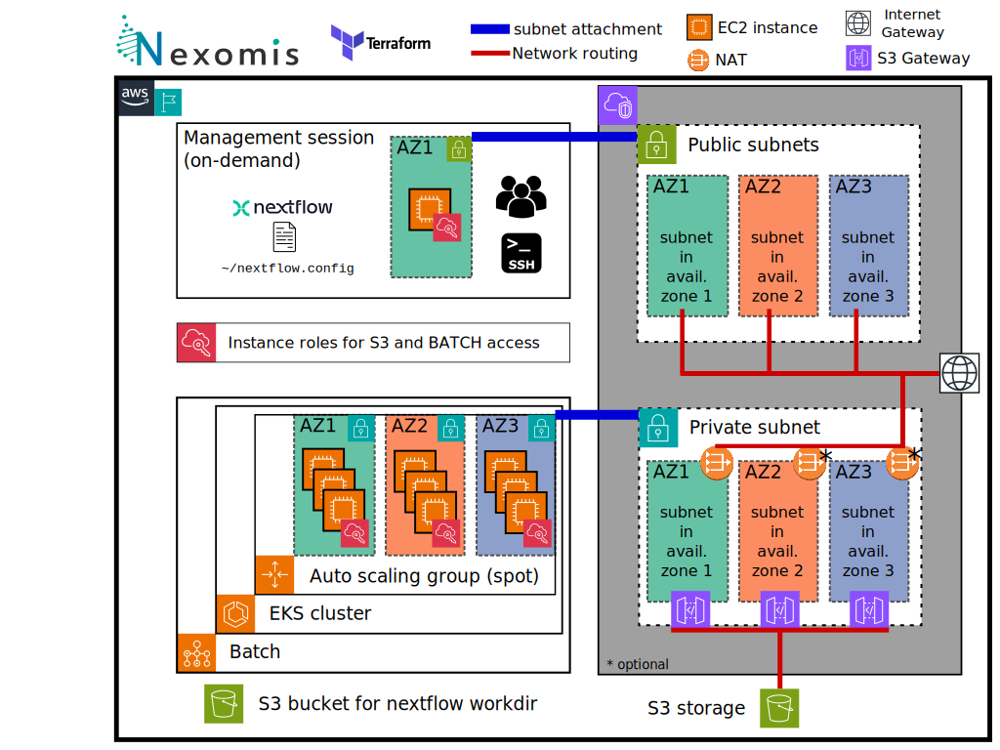

# Terraform Template for Nextflow AWS Batch

## Introduction 

This project aims at facilitating the deployment of AWS Batch infrastructure to use Nextflow.

Below is a summary diagram:



## Prerequisites

- [Terraform](https://www.terraform.io/downloads.html) installed
- AWS CLI installed and configured with the appropriate profile

> Note that you'll need the AWS CLI version 2

```
aws configure sso
```
> **Importantly** the profile needs the following access

**Required AWS Managed policies**:

- AmazonEC2FullAccess
- AmazonECS_FullAccess
- AmazonS3FullAccess
- AWSBatchFullAccess
- AWSImageBuilderFullAccess
- IAMFullAccess

> **Note:** These permissions are broad and should be refined for production environments. The setup includes a Nextflow-specific user with more restricted permissions.

## Configuration

### 1. **Clone the repository**

   ```sh
   git clone https://github.com/nexomis/terraform_nf_awsbatch.git
   cd terraform_nf_awsbatch
   ```

### 2. (*Optional*) **Create a `backend.tf` file** (optional, if you want to use remote state storage with S3)

Manually create a S3 bucket `XXXXXXXXXXXXXXXXXXXX` in the appropriate region. 

> **Note:** Bucket name and region are configurable in `backend.tf`.

   ```hcl
   terraform {
     backend "s3" {
       region = "eu-west-3"
       bucket = "XXXXXXXXXXXXXXXXXXXX"
       key    = "YYYYYYY.tfstate"
     }
   }
   ```

### 3. **Create a `main.auto.tfvars` file** to specify variables with no default values. Here is an example:

  ```hcl
  prefix = "nf_awsbatch_jfouret"
  new_tmp_bucket_for_env = "nf-awsbatch-jfouret.tmp"
  ```

## Usage

### Quick start

Run the following commands to initialize and apply the Terraform configuration:

```
terraform init
terraform apply
```

### Inputs

## Inputs

| Name | Description | Type | Default | Required |
|------|-------------|------|---------|:--------:|
| <a name="input_aws_profile"></a> [aws\_profile](#input\_aws\_profile) | AWS profile | `string` | n/a | yes |
| <a name="input_aws_region"></a> [aws\_region](#input\_aws\_region) | AWS region | `string` | `"eu-west-3"` | no |
| <a name="input_batch_instance_type"></a> [batch\_instance\_type](#input\_batch\_instance\_type) | list of instance types for AWS Batch | `list(string)` | <pre>[<br>  "r5a.4xlarge",<br>  "r5a.8xlarge",<br>  "r5.4xlarge",<br>  "r5.8xlarge",<br>  "m5a.4xlarge",<br>  "m5a.8xlarge",<br>  "m5.4xlarge",<br>  "m5.8xlarge",<br>  "c5a.4xlarge",<br>  "c5a.8xlarge",<br>  "c5.4xlarge",<br>  "c5.8xlarge"<br>]</pre> | no |
| <a name="input_batch_volume_iops"></a> [batch\_volume\_iops](#input\_batch\_volume\_iops) | IOPS for block storage for Batch instances | `number` | `6000` | no |
| <a name="input_batch_volume_size"></a> [batch\_volume\_size](#input\_batch\_volume\_size) | Volume size  for Batch instances that must be higher than the root volume from base ami | `number` | `1000` | no |
| <a name="input_batch_volume_throughput"></a> [batch\_volume\_throughput](#input\_batch\_volume\_throughput) | Throughput (MB/s) for block storage for Batch instances | `number` | `500` | no |
| <a name="input_max_cpus"></a> [max\_cpus](#input\_max\_cpus) | Max number of CPUs | `number` | `128` | no |
| <a name="input_new_tmp_bucket_for_env"></a> [new\_tmp\_bucket\_for\_env](#input\_new\_tmp\_bucket\_for\_env) | The name of a bucket that will be created for tmp data | `string` | n/a | yes |
| <a name="input_prefix"></a> [prefix](#input\_prefix) | The prefix for naming | `string` | n/a | yes |
| <a name="input_session_instance_type"></a> [session\_instance\_type](#input\_session\_instance\_type) | Instance type to use for the session (c5n good for network) | `string` | `"c5n.xlarge"` | no |
| <a name="input_session_volume_iops"></a> [session\_volume\_iops](#input\_session\_volume\_iops) | IOPS for block storage for Session instance | `number` | `3000` | no |
| <a name="input_session_volume_size"></a> [session\_volume\_size](#input\_session\_volume\_size) | Volume size  for Session instance that must be higher than the root volume from base ami | `number` | `100` | no |
| <a name="input_session_volume_throughput"></a> [session\_volume\_throughput](#input\_session\_volume\_throughput) | Throughput (MB/s) for block storage for Session instance | `number` | `125` | no |
| <a name="input_tower_access_token"></a> [tower\_access\_token](#input\_tower\_access\_token) | The token from the seqera plateform to use wave | `string` | n/a | yes |
| <a name="input_use_fusion"></a> [use\_fusion](#input\_use\_fusion) | Flag to determine whether to use fusion or not | `bool` | `false` | no |

### Outputs

| Name | Description |
|------|-------------|
| <a name="output_private_key"></a> [private\_key](#output\_private\_key) | Path of the private key to connect the session instance |
| <a name="output_public_ip"></a> [public\_ip](#output\_public\_ip) | IP of the session instance to connect to start a pipeline |
| <a name="output_username"></a> [username](#output\_username) | Username to use with SSH |

### Run a nextflow pipeline

First, connect to the EC2 instance with SSH.

```
NXF_VER=23.10.0 nextflow -c ~/nextflow.config nexomis/primary

```

## Inspirations 

I have followed the following ressources to elaborate this template:

- [Seqera Labs Nextflow and AWS Batch Integration Part 1](https://seqera.io/blog/nextflow-and-aws-batch-inside-the-integration-part-1-of-3/)
- [Seqera Labs Nextflow and AWS Batch Integration Part 2](https://seqera.io/blog/nextflow-and-aws-batch-inside-the-integration-part-2-of-3/)
- [STAPH-B Public Health Bacterial Bioinformatics Portal](https://staphb.org/resources/2020-04-29-nextflow_batch.html)
- [AWS Open Data Genomics Workflows](https://docs.opendata.aws/genomics-workflows/orchestration/nextflow/nextflow-overview.html)

Of note, with the introduction of wave and fusion some things have changed, therefore the use of image is less necessary. In addition I tried to use more of role-defined permission rather than using acess key or secret.

## Modules

### Module: `nf_awsbatch_network`

Establishes a VPC with both public and private subnets across availability zones.

- **Options**
  1. Private subnets in AWS Batch with a NAT Gateway per availability zone.
  2. Private subnets with a single NAT Gateway (default).
  3. Public subnets without NAT, assigning public IPs to each instance.
- **Pricing considerations**
  - NAT Gateway uptime and data transfer processing fees.
  - Cross-zone data transfer costs when using a single NAT.
  - Elastic IPv4 charges for NATs or instances in public subnet scenarios.

For more details : https://aws.amazon.com/vpc/pricing/

### Module: `nf_awsbatch_batch`

Configures the AWS Batch infrastructure, tailored for optimal performance with typical Nextflow use cases.

### Module: `nf_awsbatch_session`

Facilitates setting up a session with an EC2 instance for launching Nextflow runs. This module includes:

- Creation of an S3 bucket for storing Nextflow intermediate files.
- Provisioning an instance in the same region as AWS Batch for efficient interaction with the S3 bucket.
- A basic Nextflow configuration file for AWS Batch.
- Installation of `awscli` and `mount-s3`, with instance roles permitting S3 access.

### Template `main.tf`

Serves as an example showcasing the integration of all modules.

Output of the instance IP and provision of `generated_key.pem` for secure to the batch session.

## known limitation

Cross-region S3 Gateway have not been setup https://repost.aws/knowledge-center/vpc-endpoints-cross-region-aws-services
